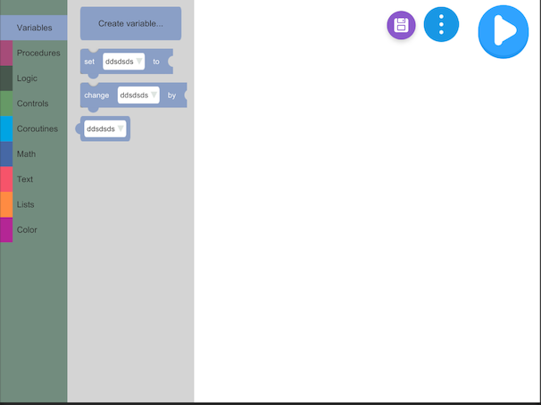
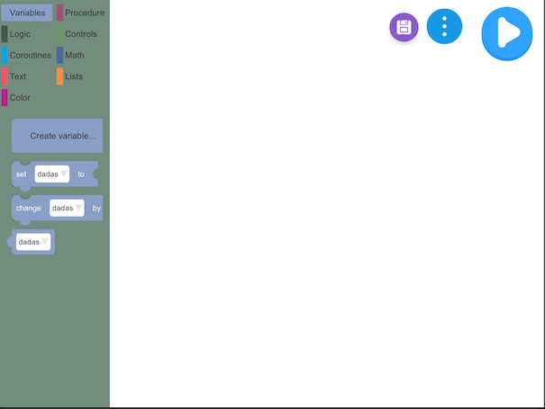
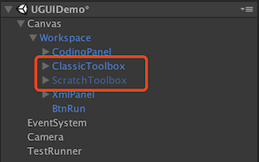

# UBlocky

See the follows for details:

1. http://magicbell.beanstu.io/unity/2017/10/11/blockly-one.html
2. http://magicbell.beanstu.io/unity/2017/10/14/blockly-two.html
3. http://magicbell.beanstu.io/unity/2017/10/22/blockly-three.html
4. http://magicbell.beanstu.io/unity/2017/10/31/blockly-four.html

Have fun with [2 game demo](https://github.com/imagicbell/ublocklygame).

## HOW TO RUN

1. open **Examples** in Unity.
2. Hit menu **UBlockly/Build Block Prefabs** and wait to finish prefabs building.
3. open scene **UGUIDemo**.
4. Hit play and have fun. 

There offered two UI themes: google blockly style and scratch style. Default is scratch(I prefer~).

To change themes:

1. Drag the prefab **UBlocklyData/Toolboxs/Prefabs/ClassicToolbox** under the scene object **Canvas/Workspace** (Make sure the scene **UGUIDemo** is opened).

2. Delete or hide the other theme prefab **ScratchToolbox**.

3. Attach the **ClassicToolbox** to the component **WorkspaceView** on scene object **Workspace**.

4. Hit play and have a look.

   

## Contributors

Greatly appreciate the help by:

[liangxie](https://github.com/liangxieq)

[dtknowlove](https://github.com/dtknowlove)

